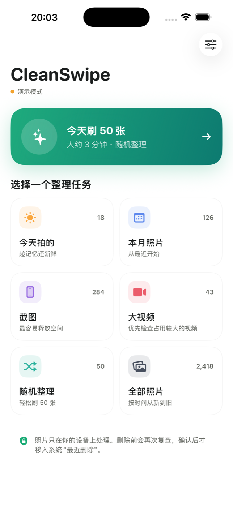
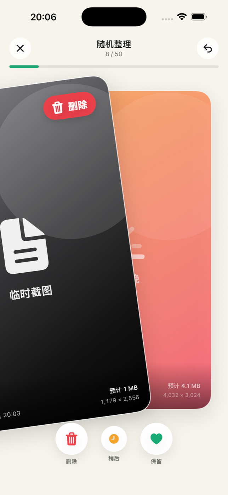
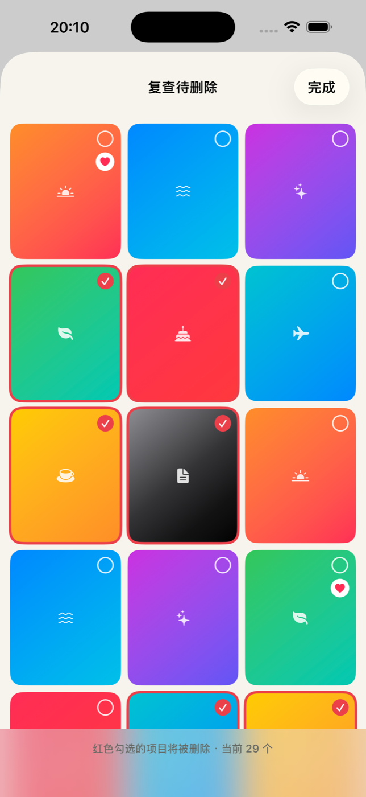
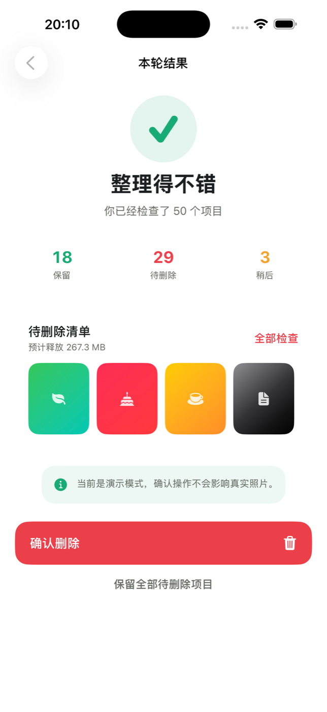

<div align="center">
  
  <h1>CleanSwipe</h1>
  <p>Review your photo library one card at a time — keep, delete later, or decide later.</p>
  <p>
    <a href="README.zh-CN.md">简体中文</a> ·
    <a href="PRIVACY.md">Privacy</a> ·
    <a href="CONTRIBUTING.md">Contributing</a>
  </p>
  <p>
    
    
    
    
  </p>
</div>

## Preview

<p align="center">
  
  
  
  
</p>

## Why CleanSwipe?

Large photo libraries are difficult to review in a grid. CleanSwipe turns cleanup into short, focused sessions: one item, one decision, and a review step before anything changes.

- **Swipe right** to keep.
- **Swipe left** to add an item to the pending-deletion list.
- **Swipe up** to decide later.
- **Undo** the latest decision at any time during a session.
- **Review every deletion** before submitting changes to iOS.

## Features

- Native SwiftUI card interface with drag, rotation, and decision overlays
- Real PhotoKit library access plus a safe, permission-free demo mode
- Today, current month, screenshots, long videos, random, and all-photo sessions
- Sound and haptic feedback with independent controls
- Full-screen preview, double-tap zoom, and pinch-to-zoom
- 50-item sessions with progress, undo, summary, and estimated space recovery
- Final thumbnail grid to add or remove items from the deletion set
- Extra warning when pending items include Favorites
- Local “already reviewed” history, with a reset control
- No account, analytics, ads, server, or photo upload

## Safety model

CleanSwipe deliberately separates a swipe from a deletion:

1. A left swipe only stages the item inside the current session.
2. The user reviews the staged items in a grid.
3. The user confirms the final set.
4. The app asks PhotoKit to delete those assets.
5. iOS moves deleted assets to the system **Recently Deleted** collection, where recovery is normally available for 30 days.

If iCloud Photos is enabled, a deletion may sync to other devices signed in to the same Apple Account. Test with nonessential photos first.

## Requirements

- macOS with Xcode 15 or later
- iOS 17.0 or later
- A free Apple Account for personal-device testing, or an Apple Developer Program membership for TestFlight/App Store distribution

## Getting started

```bash
git clone https://github.com/Wmyyy-29/CleanSwipe.git
cd CleanSwipe
open CleanSwipeDemo.xcodeproj
```

Then in Xcode:

1. Select the `CleanSwipeDemo` target.
2. Open **Signing & Capabilities**.
3. Choose your own Team.
4. Change `com.personal.CleanSwipeDemo` to a unique bundle identifier.
5. Select an iPhone simulator or a connected iPhone and press **Run** (`⌘R`).
6. Choose **Demo Mode** first, or grant limited/full Photos access for real-library testing.

No third-party dependencies are required.

## Project structure

```text
CleanSwipe/
├── CleanSwipeDemo.xcodeproj
├── CleanSwipeDemo/
│   ├── Models/
│   ├── Services/
│   ├── ViewModels/
│   ├── Views/
│   ├── Assets.xcassets/
│   ├── Info.plist
│   └── PrivacyInfo.xcprivacy
├── docs/
│   ├── ARCHITECTURE.md
│   └── images/
├── .github/
│   ├── ISSUE_TEMPLATE/
│   └── pull_request_template.md
├── .gitignore
├── CONTRIBUTING.md
├── PRIVACY.md
├── SECURITY.md
├── README.zh-CN.md
└── LICENSE
```

See [Architecture](docs/ARCHITECTURE.md) for the data flow and component responsibilities.

## Current limitations

- Storage recovery is an estimate. PhotoKit does not expose an exact file size for every asset through a simple public property.
- The “large videos” task currently prioritizes longer videos, not exact encoded file size.
- Similar-photo clustering, blur detection, and best-shot recommendations are not implemented.
- The app interface is currently Simplified Chinese; English UI localization is planned.
- This is an early open-source demo, not a substitute for a backup strategy.

## Roadmap

- [ ] Similar-photo groups using on-device analysis
- [ ] Blur and closed-eye detection
- [ ] English localization
- [ ] Accessibility and Dynamic Type audit
- [ ] Unit and UI tests
- [ ] More session statistics without analytics or tracking

## Privacy

Photos and metadata are processed on the device. CleanSwipe has no developer-operated backend, analytics, advertising, or photo-upload code. PhotoKit may retrieve an iCloud-managed asset from Apple so it can be displayed. See the full [Privacy Statement](PRIVACY.md).

## Contributing

Issues and pull requests are welcome. Please read [CONTRIBUTING.md](CONTRIBUTING.md) before submitting changes, especially changes involving photo access or deletion behavior.

## License

CleanSwipe is available under the [MIT License](LICENSE).

## Disclaimer

CleanSwipe is an independent open-source project. It is not affiliated with, endorsed by, or sponsored by Apple Inc. or Tinder LLC. Apple, iPhone, iCloud, PhotoKit, and related marks are trademarks of their respective owners.
